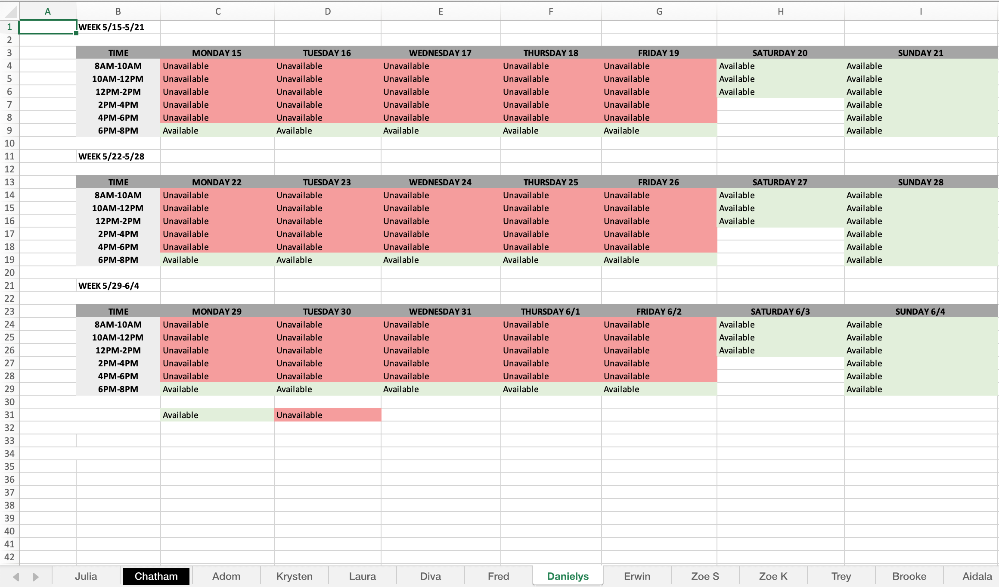
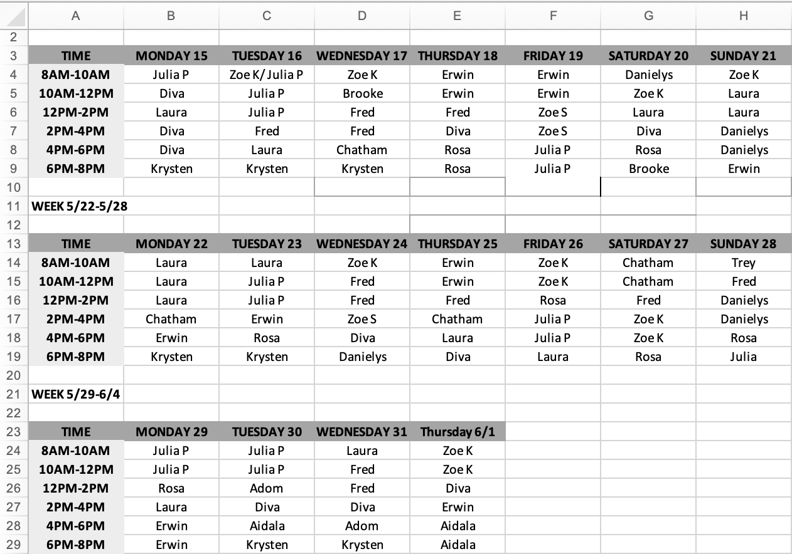

# JYC Scheduling
This is a project to automate the scheduling process for the JYC Front Desk 
> The objective of this project is to take an excel file with multiple sheets that all formatted the same way, figure out how to process it to create a master sheet. I'll explain more.

> The current system used at my work is as follows: The scheduler sends out an excel file with sheets titled with each employee's name. In each sheet, there is a calendar for each month & each day is divided up into 2 hour chunks where employees indicate whether they are available to work the 2 hour block or not. Once each employee has their availability in, the scheduler goes & checks each sheet individually to determine which & how many hours each employee will work. The finished product is a master sheet titled "Final" which consists of the same calendar, but with each employee's name in the chunk that they will be working. 

# Pre-Processing

> This is what the final sheet looks like before population

> Here is an example of a sheet with completed availability.

# Post-Processing

> This is the desired result

