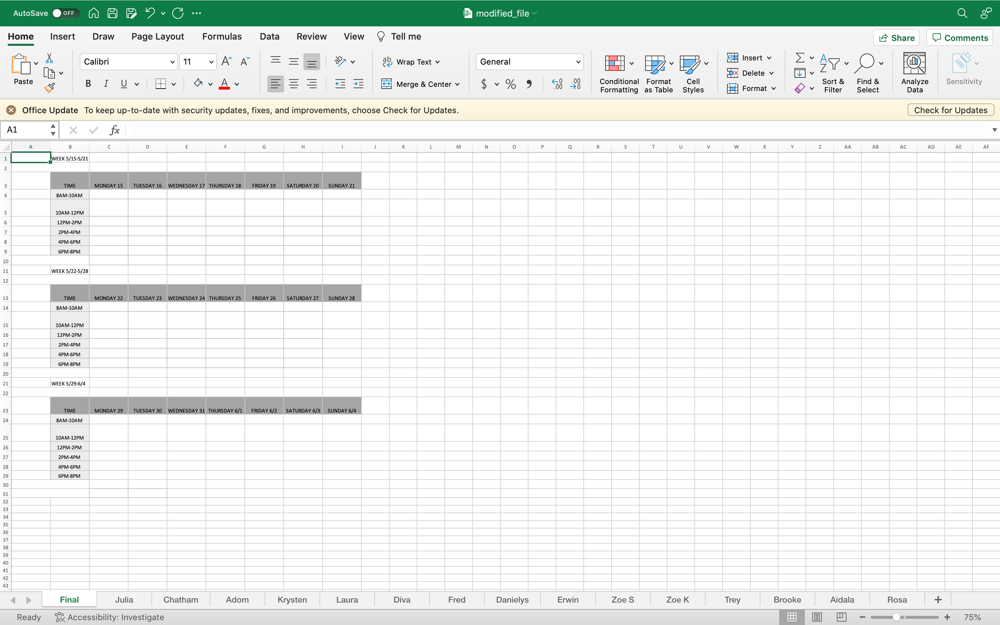

# JYC Scheduling
This is a project to automate the scheduling process for the JYC Front Desk 
> The objective of this project is to take an excel file with multiple sheets that all formatted the same way, figure out how to process it to create a master sheet. I'll explain more.

> The current system used at my work is as follows: The scheduler sends out an excel file with sheets titled with each employee's name. In each sheet, there is a calendar for each month & each day is divided up into 2 hour chunks where employees indicate whether they are available to work the 2 hour block or not. Once each employee has their availability in, the scheduler goes & checks each sheet individually to determine which & how many hours each employee will work. The finished product is a master sheet titled "Final" which consists of the same calendar, but with each employee's name in the chunk that they will be working. 

# Creating Final Schedule from Multiple Sheets
> This code allows you to create a final schedule by selecting random cells from multiple sheets in an Excel workbook and placing them into the corresponding cells in a sheet titled "Final".

# Prerequisites
- Python 3.x
- openpyxl library
# How to Use
1. Ensure that the Excel file containing the data is in the specified location ('file_path').
2. Install the openpyxl library if you haven't already (pip install openpyxl).
3. Run the creatingFinalSchedule.py script.
4. The script will load the Excel file, select random cells from each sheet (excluding the "Final" sheet), and store them in the cell_coordinates dictionary.
5. The selected cells along with their values will be placed in the corresponding cells in the "Final" sheet.
6. The modified workbook will be saved as modified_file.xlsx.